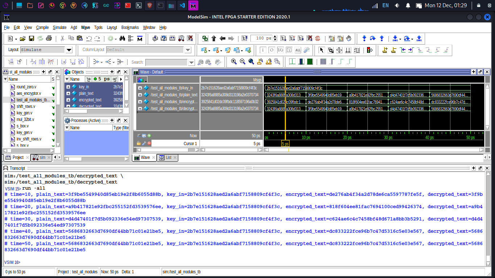

# 
Advanced Encryption Standard

### VLSI Implementation of 128-bit Advanced Encryption Standard (AES)

AES is an encryption standard chosen by the National Institute of Standards and Technology (NIST), USA to protect classified information. It has been accepted world wide as a desirable algorithm to encrypt sensitive data. It is a block cipher which operates on block size of 128 bits for both encrypting as well as decrypting. It was developed for replacing DES (slow and vulnerable to various attacks).

### Encryption Using Verilog
Encryption needs two input :
1. Plain Text
2. Key

Output generated is cipher text.

### Decryption Using Verilog
Decryption Module needs two input:
1. Encrypted i.e. cipher text
2. Key

Output generated is the original text that was fed in encryption module

### Testing For various 128 bit data and key input
- Test directory contains all the modules of Encryption and Decryption
- And test_all_modules module is created to instantiate both the module aes_encryptor and aes_decryptor to make a top level module for testing of multiple inputs
- Testbench file is used for giving inputs and analysing the results displayed in command window and wave window.

### Simulation result screenshot

### Contributors
- Deepak Sagar
- Ravi Kumar Yadav
- Saurabh Kumar
